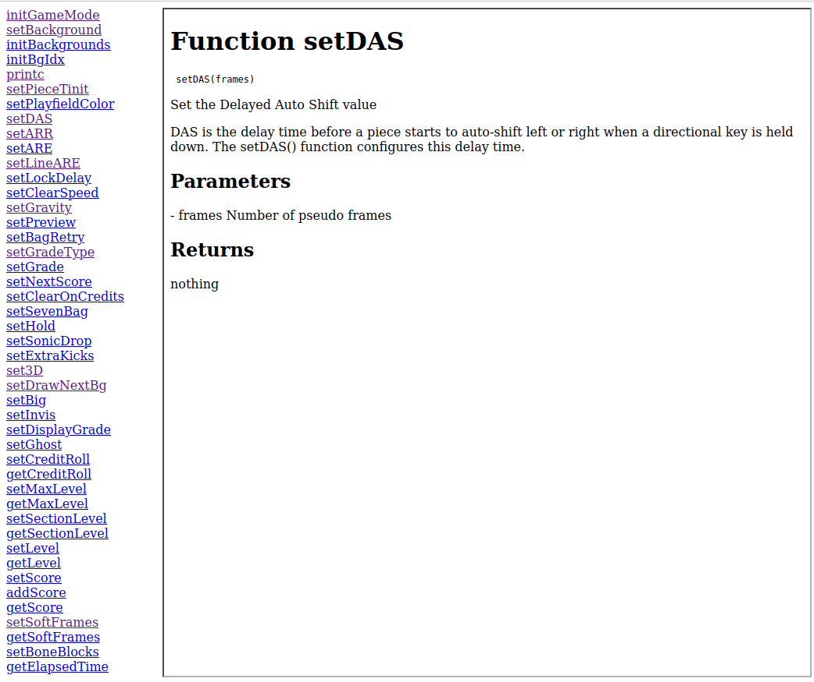

# tuxdoc
Generate lua documentation from C files. Created specifically for my game [tuxmino](https://github.com/masonarmand/tuxmino).  
This program will look in a c file for docstrings formatted like this:
```c
/*
 * lua function
 * @brief a brief description
 * A full summary. Can be multiple lines.
 *
 * @param parameter_name Description of parameter
 * @returns return_type Description of return type
 * @usage functionPrototype(parameter_name)
 */
```
It will then convert this into a text file and use my other tool [txt2web](https://github.com/masonarmand/txt2web) (a static site generator that I made), to convert the text file into html. Then it will generate a homepage with a navigation bar for the functions.

Example generated output:  

